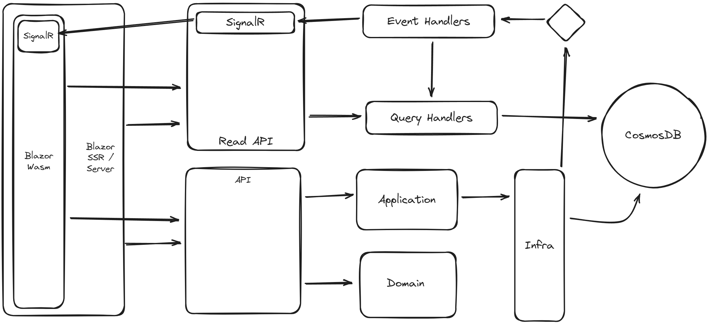

# Retrospective

**Retrospective** is an open-source tool to support team's retrospective ceremony.

This tool was initially designed and developed to be an example for Blazor/ASP.NET course, but it's also fully functional application.

## Features

Here is a list of planned features in Retrospective. Implemented features are marked by checked checkbox.

- [ ] Board management
    - [ ] Team boards
        - [ ] Create board with Good/Bad/Improvements columns
        - [ ] Close previous board when new one is created
        - [ ] Add open items to new board
    - [ ] Board actions
        - [ ] Move items between columns
        - [ ] Reorder items in column
    - [ ] Items
        - [ ] Create item in column
        - [ ] Close item
        - [ ] Reopen item
        - [ ] Archive item
        - [ ] Change item's title
        - [ ] Vote for item
- [ ] Retro session
    - [ ] Session for board
        - [ ] Create session
        - [ ] Finnish session and close board
        - [ ] Add opened actions to the session
    - [ ] Session stages
        - [ ] Previous session summary stage
        - [ ] Fill up/voting stage
        - [ ] Retro session stage
        - [ ] Session summary stage
    - [ ] Retro actions
        - [ ] Add action to the item
        - [ ] Vote for actions
- [ ] Retro history
- [ ] Actions
    - [ ] Change action's item
    - [ ] Finish action
    - [ ] Reopen action
    - [ ] Archive action
    - [ ] Change action's title
    - [ ] Vote for actions
- [ ] Team management
    - [ ] Create team
    - [ ] Join the team
        - [ ] Join by code
        - [ ] Join by link
    - [ ] Accounts
        - [x] Create account
        - [x] Login
        - [ ] Delete account
        - [ ] Login by Azure AD
    - [ ] Profiles
        - [ ] Manage details
        - [ ] Profile activities
        - [ ] Profile picture

## Model Design

## Technology

### Architecture

### Tech-stack

The main reason to build Retrospective.Dev is provide example of production-ready code written in tech stack listed below:

- ASP.NET Core 8
- Blazor
- Tailwind
- SignalR
- Entity Framework Core
- Azure SQL Server
- Azure Cosmos DB
- Azure Service Bus
- GitHub Actions
- Azure App Service

## Contribution

As an Author, I didn't assume the possibility of contribution for anyone else. The result of this decision is lack of ready-to-take issues or detailed description how you can contribute.

But, if you want to propose your changes in the project, you can do it by forking this repository and creating pull request, as it's described here:
**[Pull request from fork](https://docs.github.com/en/pull-requests/collaborating-with-pull-requests/proposing-changes-to-your-work-with-pull-requests/creating-a-pull-request-from-a-fork)**. Feel free to adding issues if you find any problem or improvement in my code.

In case of any question, send me an email to **contact@zajacmarek.com**